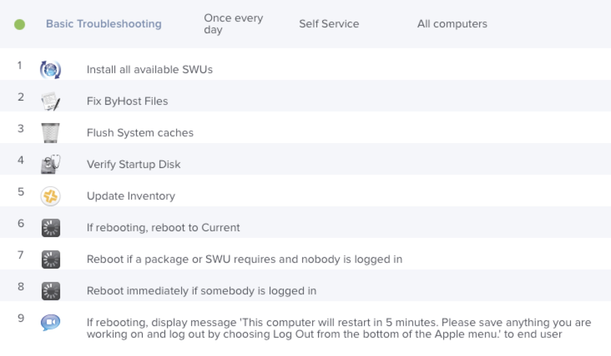
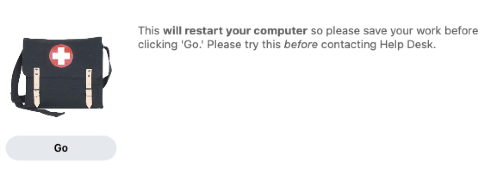
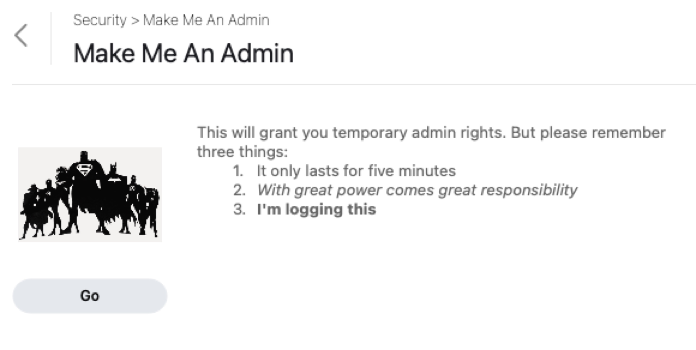
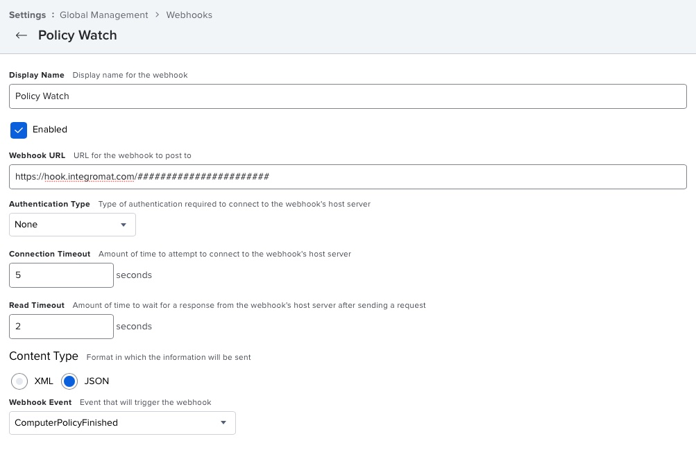
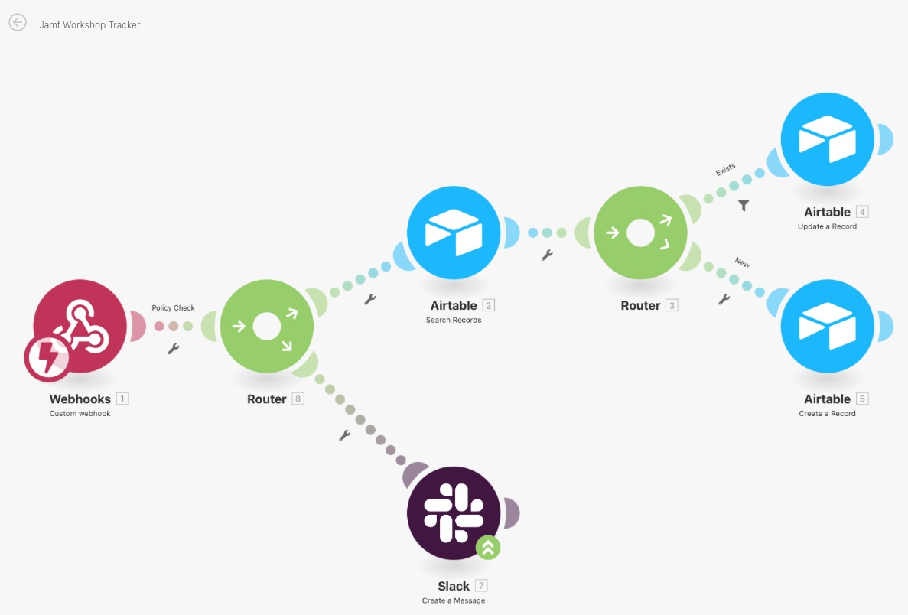
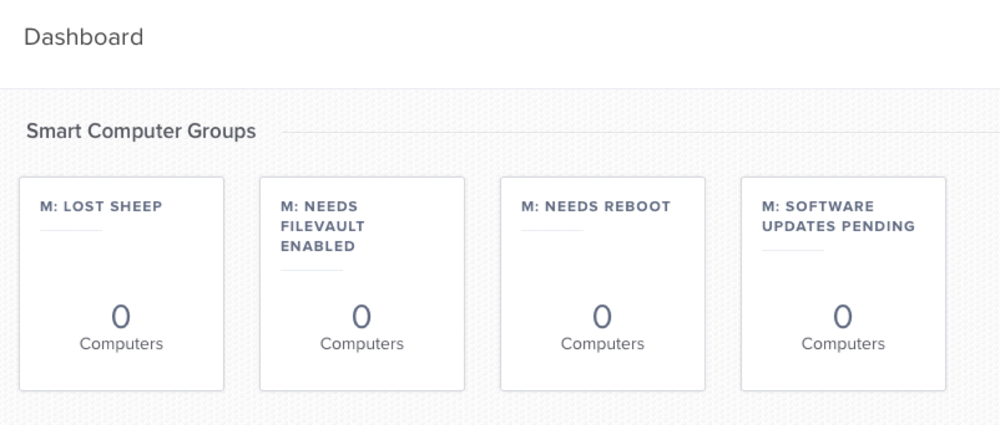

# Standing on the Shoulders of Giants <br/> *-or-* </br> What I've Stolen from JNUCs Past

> "If I have seen further it is by standing on the shoulders of Giants."
>
> ~Isaac Newton[[1](https://en.wikipedia.org/wiki/Standing_on_the_shoulders_of_giants)]

## About This Presentation

The first time I worked with Jamf was in 2009. I had just starting working with a consulting company and my first client was a school district that used Jamf Pro *(fka Casper Suite)* to manage all their Macs.

I attended my first Jamf 300 *(fka Casper Certified Administrator)* course a few months later in February of 2010. Later that year I attended the second JNUC (my first) in the fall.

Those first JNUCs were full to the brim with new ideas and skills I could take home and help my coworkers and/or clients. And every JNUC has had at least one *"Ah-ha!"* moment since.

Aside from the first one in 2009 and the one 2012 which I missed to a family emergency, I've managed to attend all the others. This year marks my 10th JNUC and I'm happy to be presenting.

Over the years I've taken the things I learned at JNUC and tweaked them, updated them, and (dare I say) improved upon them from time to time. And I've leveraged them to solve problems from past jobs through current clients. And I wouldn't have been as successful were it not for the presenters of JNUCs past who shared their wisdom so freely.

So this year's presentation is meant to call out a handful of presentations that have meant the most to me and to show how I've used them and share the little "*pearls of wisdom*" that have come out of them.

---

## Getting Your Users to Do Your Job (Without Them Knowing It)
**[Andrina Kelly - 2013](http://rkmn.tech/jnuc21/giants/kelly)**

To this day Andrina's presentation in 2013 remains one of my favorites. While her 'gimmick' *(no spoilers)* definitely made it memorable, it was the content that pushed it ahead of the pack. I had two big takeaways:

### Basic Troubleshooting

The old trope of "have you tried turning it off an on again" is ubiquitous in the technology world. Mostly because... it works! But there are a lot of reasons people never choose to reboot like time and inconvenience. And then they call us when things go wrong and we ask them to reboot and they balk it.

But what if we gave them a magic button they could push to fix most computer problems! That's what this policy does.

And since the reason people keep skipping software updates is because it wants them to reboot... let's install those while we're at it.




### Make Me An Admin


The year that Andrina gave this talk presenting her solution for granting admin rights on a *temporary* basis and automatically taking it back, I was working at a manufacturing company with this exact need. It was the perfect solution at the perfect time.

Over the years, I've implemented a version of this for almost every client I've ever had. Yes. The need is *that* ubiquitous.

I'm far from the only person to do something like this. In fact, in her presentation Andrina cites [Kyle Brockman](https://github.com/darklordbrock/scripts/blob/master/UW-Milwaukee/30minAdminJss.sh)'s script in a [Jamf Nation Discussion](https://community.jamf.com/t5/jamf-pro/temporary-admin-using-self-service/td-p/52804) as the inspiration for her own workflow. [Jamf's own GitHub page](https://github.com/jamf/MakeMeAnAdmin) has a version as well.

As of this writing, [our version](https://github.com/Rocketman-Tech/MakeMeAnAdmin/tree/af58071812d89cf428b6ab2cf432d7531ece3c2f) has a few additions to make it modular enough to drop it into a client's Jamf Pro server and shape the functionality with script parameters in the policy that drives it.

The link to the most [current version](https://github.com/Rocketman-Tech/MakeMeAnAdmin) can be found on our GitHub page along with additional documentation.

---

## Add Pop and Practicality with a Clean User Interface
**[Arek Sokol and Jason Borchardt - 2014](https://rkmn.tech/jnuc21/giants/sokol-borchardt)**

In their presentation, Arek and Jason each hit a key point for me.

Arek started with a discussion on how to approach the process. He emphasized starting with thinking about the *what* and *why* but also the ***who*** and considering exactly how your interaction will be perceived by your people.

One of the biggest challenges I've faced over the years comes from two places:

1. **Signal/Noise** - We are bombarded with so many notifications and pop-ups on a daily basis and we have so many windows/tabs open at any time that it's hard to find a way to get the attention of our people and get them to take action.
2. **Security** - A lot of us have spent so much time getting people *not* to click on every single thing that pops up that now we have to work even harder to get them to get them to click on the *right* things.

He also discussed "TIMTOWTDI" or "There is more than one way to do it."

I also follow the philosophy that says,

> "I suppose it is tempting, if the only tool you have is a hammer, to treat everything as if it were a nail."
>
> ~[Abraham Maslow](https://en.wikipedia.org/wiki/Law_of_the_instrument)

As such I try to keep a number of tools in the box, as it were.

Arek provided the following list of tools for developing a GUI interface:

* **AppleScript**
* **jamfHelper**
* ~~~cocoaDialog~~~ *(no longer maintained)*
* [terminal-notifier](https://github.com/julienXX/terminal-notifier)
* *Xcode*
* *Python*

Sadly, cocoaDialog is gone. Xcode not only has a higher learning curve, but then you have to distribute the files. And I find the builtin GUI libraries for Python annoying and to use better ones requires either distributing those libraries or ["freezing your code"](https://docs.python-guide.org/shipping/freezing/) and distributing the file(s).

So I find AppleScript and jamfHelper to be the best built-in tools for daily use.

But if you saw my presentation last year, "[Beyond Step Three or The Magic of Endpoint Provisioning](https://rkmn.tech/jnuc20/magic)," you'll know that I really like using [DEPNotify]() in onboarding workflows to keep people informed throughout the process.

### Thinking Outside the Apple Crate

This past summer found me with a unique challenge for a client. In the past they held in-person workshops for new computer deployment. With everyone working remote, these moved virtual.

After initial introductions and a summary of the process, each person would start their computer going through the onboarding workflow. If we were in-person it would have been easy to keep an eye out on where everyone was in the workflow.

But in a virtual setting? Even though the intro had included a series of slides and screenshots on what to expect, the first workshop turned into a constant stream of overlapping voices asking for help and asking the same questions over and over. And worse, some people who had problems didn't say anything and just sat waiting! The entire workshop was scheduled for one hour but ran for close to two hours.

There had to be a better way!



I ended up (subconsciously, perhaps) following Arek's advice on stepping back and thinking about the who and the why to guide your tool selection. I decided to leverage [Jamf's webhooks](https://www.jamf.com/resources/videos/an-introduction-to-webhooks) and a few external tools:

* [Integromat](https://integromat.com) - An automation system like [IFTTT](https://ifttt.com) or [Zapier](https://zapier.com) to connect web services together
* [Airtable](https://airtable.com) - A cloud-based database service
* [Slack](https://slack.com) - The ubiquitous and easily extensible team chat service


Now whenever a computer finished a policy in the workflow , it would send a webhook to my Integromat scenario which would check the policy ID and, if it was on the list of onboarding policies, create or update a record in Airtable indicating the current step of the workflow they were at with the time, and send a message to me in Slack.



So at the remaining workshops I was able to keep an Airtable window open to see the total "scoreboard" and Slack became my own personal announcer. I was able to say things like,

- "I see Alice has reached step five. You should be getting a request for your username and password."
- "Bob, it looks like you've been stuck on step eight for a while. Are you seeing any error messages?"
- "It looks like Mallory just finished the whole process. Unless you have any questions, you are free to go."

I announced each person reaching a new step like I was calling at a racetrack which kept the mood a lot lighter as well. We were done with time to spare.

---

## Moving Beyond "Once Per Computer" Workflows
**[Bill Smith - 2017](https://rkmn.tech/jnuc21/giants/talkingmoose)**

Bill (aka Talking Moose) actually has two slots on my top ten JNUC presentations list. The other is his 2019 presentation, "[Who's Afraid of the Command Line? — Taking the Mystery Out of the Terminal and Scripting](https://www.youtube.com/watch?v=U4DNSvd0gWw)."

But today I’m talking about his presentation from 2017.

Bill had a lot of great advice. Much of which I still quote during JumpStart training sessions. Including, but not limited to:

* Develop an opinion about why you do the things you do
  * And be prepared to back it up
* Choose naming schemes for things *(categories, policies, packages, etc.)* that tell you what they are for at a glance.
* Document everything!

Let's start with documentation. With the obvious (and odd) exceptions of [groups and policies](https://ideas.jamf.com/ideas/JN-I-15679), you can add descriptions/notes to just about every object in Jamf. So why not:

* Add a note to each package on how you made it or where you got it
* Provide a nice, clean summary of what a script does
* Explain what security guidelines a configuration profile provides

Sure, there is a history button at the bottom that will show when an object was created or edited and by whom, but that's only good for as long as your log flushing settings provide. And while you can get some details from most objects, it doesn't highlight exactly what changed. So for the sanity of your co-workers and/or the admin that comes after you, please document things when you make them. At the very least, think of one of the most important people on your team: the *you* six months from now. Once that history rolls over and you are staring at a screen wondering what past you was thinking, you'll wish you had.

And it's a good habit in other aspects of your life as well. For example, my wife and I love cooking dinner together. We use a [recipe manager](https://recipekeeperonline.com) on our iPads to plan meals and grocery shopping and coordinate cooking. And every time we try some twist, we add a note to our future selves. The other night I found this thread in the recipe:

> Dear Future Ruth and Chad,
>
> Use the cast-iron skillet for this. We tried with the other deep pan and it wasn't quite right.
>
> Love, Ruth and Chad <br/>
> June 3rd, 2018
>
> **
>
> Dear Past Ruth and Chad,
>
> You are very wise. It’s like you knew we weren’t sure which pan to use! 😎
>
> Love, Ruth and Chad <br/>
> January 5th, 2020

Now let's talk about naming and taxonomy.

At Rocketman, the names of all our smart and static groups start with either an "S:" or "M:" to indicate if they are there for *(S)cope* or *(M)onitoring* respectively. That way we know at a glance what their purpose is. We have a Python script we use to perform ongoing health checks of our clients servers. One of the blocks of the report lists all groups that aren't being used in any policies or configuration profiles.

So if a group name on that report starts with "S:" it has likely been orphaned along the way and can be deleted. But if it start with "M:" it may be pinned to someone's dashboard.

I really liked Bill's suggestion of creating smart groups to indicate the way things *should* be and then create policies that are scoped to "All Computers" *excluding* those that are already in that group.

For example, a smart group might be called "Has Google Chrome" and a policy that deploys Google Chrome would be scoped to all computers *excluding* the ones that have it.


But here's where I have a different opinion. ...and I'm prepared to back it up.

Don't get me wrong. I like the philosophy of choosing to [*always look on the bright side of life*](https://en.wikipedia.org/wiki/Always_Look_on_the_Bright_Side_of_Life), but what if I flip it instead. What if I have a smart group called "M: Needs FileVault" and I pin it to my dashboard? And maybe a few other smart groups looking for trouble?

Now when I log into Jamf, I (hopefully) see a row of little zeros across the top. And, if not, I can click on the non-zero numbers and see who is non-compliant.

---

## Using "Reverse Extension Attributes" to Improve macOS Patching
**[Dan Hoffman - 2018](https://rkmn.tech/jnuc21/giants/hoffman)**

It's hard to not love a presentation that includes Doug the dog from the movie, "Up," so when you work for Pixar, you have a bit of an advantage.

I love Extension Attributes in Jamf! The ability to add *any* field to the database I want and instantly be able to create smart groups and advanced searches around it? Awesome! And it sure beats the pants off the old days of dummy receipts and such.

But before Dan's presentation, it had never occurred to me that not everything *needs* to be stored in Jamf nor worth the hassle of calling the API all the time.

His idea, which I have ~~~stolen~~~ embraced ever since, is to use 'defaults read/write' (or some other technique for interacting with plist files) to store information locally on the computer and retrieve it as needed.

**Pulling the info:**
```sh
currentSkips=$(defaults read /Library/Preferences/com.pretendo.localattributes.plist SWUSkips)
```

**Updating after:**
```sh
currentSkips=$((currentSkips+1))
defaults write /Library/Preferences/com.pretendo.localattributes.plist SWUSkips -int $currentSkips
```

So much easier than performing a GET/POST against the API!

```sh
APIAUTH=$7
APIURL=$(defaults read /Library/Preferences/com.jamfsoftware.jamf.plist jss_url)
SERIAL=$(system_profiler SPHardwareDataType | grep -i serial | grep system | awk '{print $NF}')
COMPUTERINFO=$(curl -ks -H "Authorization: Basic ${APIAUTH}" -H "Accept: text/xml" ${APIURL}JSSResource/computers/serialnumber/${SERIAL}/subset/extension_attributes)
CURRENTPASS=$(echo ${COMPTUERINFO}| xmllint --xpath "//*[name='${EXTATTR}']/value/text()" -)
```

and then

```sh
APIAUTH=$7
APIURL=$(defaults read /Library/Preferences/com.jamfsoftware.jamf.plist jss_url)
SERIAL=$(system_profiler SPHardwareDataType | grep -i serial | grep system | awk '{print $NF}')
XML="<computer><extension_attributes><extension_attribute><name>${EXTATTR}</name><value>${NEWPASS}</value></extension_attribute></extension_attributes></computer>"
curl -k -H "Authorization: Basic ${APIAUTH}" "${APIURL}JSSResource/computers/serialnumber/${SERIAL}" -H "Content-type: application/xml" -X PUT -d "${XML}"
```


### But where would I ever use this?

Good question!

Let's assume you are already a convert to the idea of putting a lot of tools and resources into Self Service as Andrina taught us. You might not want to force software updates during the day when it might cause the owner of the company to lose control of their computer during their presentation to a security update that leaves them looking at a progress bar instead of a slide deck. (*totally not based on true story or anything*) So you put a policy in Self Service for people to run on their own.

If no one does it on their own, you have to find a way to push the issue, but notifications are heavily disabled throughout the organization.

We can create a script to interact with people using jamfHelper or AppleScript to install the updates now or later. If they choose later, we increment the counter for next time. Once they reach a certain threshold, there's no more option for later and the policy runs. It doesn't take long before your people are running updates before they go to lunch.

### When API calls keep failing

Another example of this is my own version of [LAPS on a Mac](https://github.com/Rocketman-Tech/BreakGlassAdmin). The first versions relied solely on the API to retrieve and store the current password. While I still don't know why, there was a high number of calls in one direction or the other.

The current version of the script allows for storing the information via the API *or* in a local attribute plist file. And yes, at the moment I'm relying on file permissions to keep that information out of the wrong hands. For the local storage option, I have a script-based extension attribute that pulls the information at inventory update times.

The *next* version of the script will allow for storing in *both* places and it will use certificates/keychain to (de/en)crypt the information symmetrically.

---

## Shoulders Availble

Hopefully, you found something in here that helps you see further. Either just by pointing you to my original inspirations, or with my own updates and additions.

The Jamf community in general and JNUCs specifically have provided me with so much wisdom over the years that I am proud to be able to provide even a little additional altitude to the view.

---

## Bonus: The Big Sur Upgrade Challenge

I recently completed a project for a client to get all of their 300 or so computers up to Big Sur before the release of Monterey this fall. Approximately 200 of the computers needed to be updated and only 20 of them were still older than Catalina.

After getting the *"Install macOS Big Sur.app"* distributed to each of the eligible machines, I created a Self Service policy to run the upgrade and an email was sent out letting people know to update at their earliest convenience.

...no one did.

So I created a policy to run a modified version of my script that nags people to run their updates on their own. If they wait too long, we force the issue.

### Creating the GUI

My earlier script uses AppleScript for the user interaction. I chose AppleScript over jamfHelper because I found it easier to dynamically update the buttons and message text.

I was having trouble getting a consistent result from calling AppleScript from inside a shell script across versions for some reason. But I remembered that I've been referencing the ["JSS FileVault Reissue" script](https://github.com/homebysix/jss-filevault-reissue) by Elliot Jordan (another giant's shoulders) to clients for a while now and it leverages both jamfHelper *and* AppleScript for its user interaction.

So I took a look under the hood and found this:

```sh
USER_PASS="$(/bin/launchctl "$L_METHOD" "$L_ID" sudo -u "$CURRENT_USER" /usr/bin/osascript -e 'display dialog "Please enter the password you use to log in to your Mac:" default answer "" with title "'"${PROMPT_TITLE//\"/\\\"}"'" giving up after 86400 with text buttons {"OK"} default button 1 with hidden answer with icon file "'"${LOGO_POSIX//\"/\\\"}"'"' -e 'return text returned of result')"
```

The key part is this:
```sh
/bin/launchctl "$L_METHOD" "$L_ID" sudo -u "$CURRENT_USER" /usr/bin/osascript -e
```
Where:

* $L_METHOD is either 'bsexec' or 'asuser' depending on user context
* $L_ID is the *UID* of the current user
* $CURRENT_USER is the *username* of the current user

And his code cites Armin Briegel's article entitled ["Running a Command as another User"](https://scriptingosx.com/2020/08/running-a-command-as-another-user/) providing me with yet another giant set of shoulders on which to stand.

### Tracking the Status

I needed a way to track how many times people had clicked to skip the update and I didn't want to keep sending API calls to populate an extension attribute.

Instead I decided to stand on Dan Hoffman's shoulders and use his "Reverse Extension Attributes" and store the information locally.

### Putting it together

So now I have a block of code that looks something like this:

```sh
USER=$3; : ${USER:=$(/bin/ls -l /dev/console | /usr/bin/awk '{ print $3 }')}
USERID=$(id -u ${USER})

## ...

## How many times can they skip updates
SKIPSALLOWED=$([[ $4 ]] && echo $4 || echo "3") ## Three is the default

## Where are we tracking the skips
LOCALATTR="/Library/Application Support/JAMF/com.CLIENT.localattributes.plist"

## Skips so far
HASSKIPPED=$(defaults read "${LOCALATTR}" BigSurSkips 2>/dev/null || echo "0")

## Can they skip again?
REMAINING=$(expr ${SKIPSALLOWED} - ${HASSKIPPED})
if [[ ${REMAINING} -gt 0 ]]; then
	BUTTON='{"Skip", "Now"}'
	SKIPMESG="You have skipped the upgrade ${HASSKIPPED} day(s) so far with ${REMAINING} remaining."
else
	BUTTON='{"Now"}'
	SKIPMESG="You have reached your allotted amount of time. The upgrade will begin in one minute. Save your work now."
fi

## ...

## What did they choose?
response=$(/bin/launchctl asuser ${USERID} sudo -u ${USER} /usr/bin/osascript << EOL
	return the button returned of (display dialog "$DESC" buttons ${BUTTON} with title "Upgrade to Big Sur" ${LOGO})
EOL
)
```
*(Heavily redacted until I get approval to share more and get the code cleaned up)*

More importantly, I have a script that works across four versions of the OS to remind people to upgrade!

*Note:* In the end, the client did want the number of skips inside Jamf for reporting. I ended up creating a script-based extension attribute to pull the info with a 'defaults read' command.

```sh
#!/bin/bash

ATTRIBUTE="com.CLIENT.localattributes.plist"
FIELDNAME="BigSurSkips"

EXTATTRPLIST="/Library/Application Support/JAMF/${ATTRIBUTE}"
if [[ -f "${EXTATTRPLIST}" ]]; then
	RESULT=$(/usr/bin/defaults read "${EXTATTRPLIST}" ${FIELDNAME})
else
	RESULT="WARNING: Unable to read file. Will try again at next inventory."
fi

echo "<result>${RESULT}</result>"

```

<!-- Resources -->
<!--
https://rkmn.tech/jnuc21/giants/resources
-->
